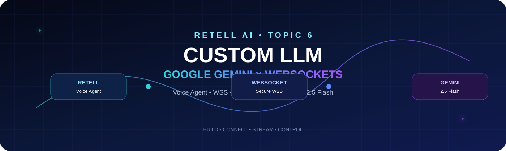

<div align="center">



<p><b>Retell AI × Google Gemini × WebSockets</b></p>

<a href="https://www.loom.com/share/572e0af396d74336b279f9ad8ef74464">🎥 <b>Watch Demo</b></a> •
<a href="https://github.com/shaikshahid777/retell-ai-topic-6-custom-llm/blob/main/README.md">📖 <b>Documentation</b></a> •
<a href="https://github.com/shaikshahid777/retell-ai-topic-6-custom-llm/tree/main/assets">🖼️ <b>Assets</b></a>

</div>

---

## ✨ Highlights

| Capability | Implementation |
|---|---|
| 🤖 LLM | Google Gemini `gemini-2.5-flash` |
| 🎙️ Voice Agent | Retell AI Custom LLM |
| 🔌 Transport | WebSocket / Secure WebSocket |
| 🌐 Public Endpoint | ngrok |
| 🔐 Authentication | Query-parameter token |
| 🧩 Retell Events | `response_required`, `update_only` |
| ☎️ Call Control | `end_call: true` |
| 🩺 Health Check | `GET /health` |
| 🧪 Validation | Gemini API + Retell WebSocket logs |

---

## 🏗️ Architecture

```text
┌──────────────────────┐
│     Retell AI        │
│  Voice Agent / Test  │
└──────────┬───────────┘
           │ WSS
           ▼
┌──────────────────────┐
│        ngrok         │
│ Public HTTPS / WSS   │
└──────────┬───────────┘
           │
           ▼
┌──────────────────────┐
│   Node.js WebSocket  │
│      server.js       │
│                      │
│ • Auth               │
│ • Retell events      │
│ • Conversation       │
│ • Call control       │
└──────────┬───────────┘
           │ HTTPS
           ▼
┌──────────────────────┐
│   Google Gemini API  │
│   gemini-2.5-flash   │
└──────────┬───────────┘
           │
           ▼
      Response → Retell
```

---

## 🎯 Topic 6 Requirements Covered

- [x] Public WebSocket server
- [x] Query-parameter authentication
- [x] Retell `response_required` handling
- [x] Retell `update_only` handling
- [x] Conversation context processing
- [x] External Gemini LLM integration
- [x] Retell-compatible JSON response
- [x] `end_call: true` call-control logic
- [x] ngrok public endpoint
- [x] Local health-check validation
- [x] Server-side connection/event logs

> **Note:** The recorded final Retell Playground test was marked **Unsuccessful** in Retell Call History. The Gemini API and server-side WebSocket validation were successful, and this repository documents the observed results accurately.

---

## 📁 Project Structure

```text
retell-ai-topic-6-custom-llm/
├── assets/
├── logs/
├── .env.example
├── .gitignore
├── EVIDENCE.md
├── assessment.json
├── package.json
├── package-lock.json
├── README.md
└── server.js
```

> `node_modules/` and `.env` are intentionally excluded from version control.

---

## ⚙️ Local Setup

### 1. Install dependencies

```bash
npm install
```

### 2. Configure environment variables

Create a local `.env` file:

```env
PORT=8080
GEMINI_API_KEY=your_gemini_api_key
CUSTOM_AUTH_TOKEN=your_custom_auth_token
GEMINI_MODEL=gemini-2.5-flash
```

**Never commit `.env` or API keys.**

### 3. Start the server

```bash
node server.js
```

### 4. Verify health

```powershell
Invoke-RestMethod http://localhost:8080/health
```

Expected fields:

```text
ok        : True
service   : retell-custom-llm
llm       : Google Gemini
model     : gemini-2.5-flash
```

### 5. Start ngrok

```bash
ngrok http 8080
```

Use the secure forwarding URL in Retell as:

```text
wss://YOUR-NGROK-DOMAIN/llm-websocket?auth_token=YOUR_CUSTOM_AUTH_TOKEN
```

---

## 🔌 Retell Event Handling

The server distinguishes between two key Retell interaction types.

### `update_only`

Used to receive transcript updates without generating a new assistant response.

### `response_required`

Used to build conversation context, call Gemini, and return a Retell response payload.

Example response shape:

```json
{
  "response_type": "response",
  "content": "Hello, how can I help you?",
  "end_call": false
}
```

For goodbye handling:

```json
{
  "response_type": "response",
  "content": "Thank you for calling. Have a wonderful day. Goodbye!",
  "end_call": true
}
```

---

## 🧪 Evidence

### Retell Configuration

The agent is configured as a **Custom LLM** agent with a secure WebSocket URL.

### Server Validation

Server logs captured:

- WebSocket connection establishment
- `update_only` events
- `response_required` events
- Gemini request initiation
- Connection close events

### ngrok Validation

The public tunnel returned successful WebSocket upgrade requests (`101 Switching Protocols`) during testing.

### Gemini Validation

The Gemini API was independently tested and returned:

```text
Gemini test successful
```

### Retell Call History

The recorded test conversation included user requests and a goodbye message. Retell recorded the final test as **Unsuccessful**.

---

## 🎥 Demo

**Loom:**  
https://www.loom.com/share/572e0af396d74336b279f9ad8ef74464

---

## 📄 Assessment Document

The evidence PDF contains the project overview, architecture, implementation details, screenshots, validation results, and links.

**Security:** Credentials and API keys are intentionally omitted from the repository and public documentation.

---

## 🧭 What I Learned

This project demonstrates practical experience with:

`Retell AI` • `Custom LLMs` • `WebSockets` • `WSS` • `ngrok` • `Google Gemini API` • `Node.js` • `JSON event handling` • `authentication` • `call control`

---

<div align="center">

### ⭐ Built as part of Retell AI Hands-On Topic 6

**Retell AI × Google Gemini × WebSockets**

</div>
